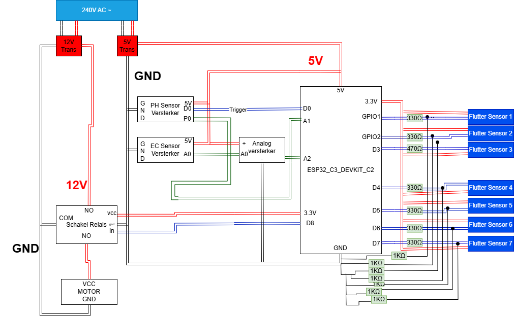

# GreenhouseWateringSystem

## Project Overview  
This project is a collaborative effort by our team to design and implement a high-tech, eco-friendly water management system for a greenhouse on our campus. The goal is to minimize the use of natural resources, such as rainwater, and create a sustainable, automated system that ensures the optimal growth environment for plants while minimizing water waste.

## Key Features:  
* **Rainwater Collection & Filtration**:  
  The system captures rainwater directly from the greenhouse roof. It filters out debris, such as sand, dirt, and leaves, ensuring clean water is stored in a reservoir. This water is then used for irrigation, reducing reliance on external water sources.

* **Nutrient and Mineral Monitoring**:  
  Sensors continuously monitor water quality, focusing on the nutrient and mineral content essential for plant growth. When deficiencies are detected, the system automatically calculates and dispenses the required nutrients to maintain optimal plant health.

* **pH Level Monitoring**:  
  The system regularly checks the pH levels of the water, which are critical for healthy plant development. If the pH drifts outside the ideal range, users receive alerts so they can quickly make adjustments to keep the water conditions perfect.

* **Reservoir Level Detection**:  
  Equipped with smart sensors, the system tracks the water level in the reservoir. It detects when the reservoir is nearly full to avoid overflow or when it is running low to prevent water shortages. This ensures a steady water supply for plants without interruptions.

* **Full Automation**:  
  The entire system operates autonomously, managing rainwater collection, filtration, nutrient distribution, pH level adjustments, and reservoir monitoring seamlessly. By automating these processes, the system eliminates the need for constant manual intervention, providing a hassle-free and reliable solution for plant care.

* **Centralized GUI**:  
  A user-friendly graphical interface serves as the central hub for monitoring and managing the entire system. Through the GUI, users can easily view real-time data on water quality, pH levels, nutrient status, and reservoir levels. The interface also allows users to make adjustments and track the overall performance of the system, offering complete control and visibility from a single location.

---

## Why This Project Matters  
Our goal is to create a sustainable, automated greenhouse that not only minimizes water waste but also ensures that plants receive the exact amount of water and nutrients they need. By using rainwater and optimizing its use based on weather forecasts, we are aligning this project with the campus’s green initiatives.

This project will serve as a model for future greenhouse installations, providing both environmental and educational value. It demonstrates how technology can be leveraged to create efficient and sustainable agriculture systems in an urban setting.

---

## Architecture  

---

## Components and Connections  

Below is a list of hardware components used in the project. For detailed connection pins and descriptions, refer to the [**Components Datasheet**](./Datasheets\DATA_README.md).

- Microcontroller (e.g., ESP32)  
- Water Level Sensor  
- pH Sensor  
- Nutrient Sensor  
- Pump Motor  
- Filtration Unit  
- Display/GUI Controller  
- Rainwater Collection Unit  
- EC Sensor  
- Shakel Relay  
- 12V Transformer 
- 5V Transformer 

---

## Installatie en Handleiding  

### Belangrijkste Stappen:
1. **Hardware Opstelling**:  
   - Installeer reservoirs met vlottersensoren voor waterniveau-detectie.  
   - Verbind de pomp voor watertransport tussen reservoirs via een relaismodule.  
   - Plaats pH- en EC-sensoren in het grote reservoir voor waterkwaliteitscontrole.  
   - Zorg voor een overflowleiding om overtollig water af te voeren.  

2. **Software Installatie**:  
   - Gebruik **Visual Studio Code** om de ESP32 te programmeren.  
   - Maak gebruik van benodigde bibliotheken zoals `WiFi` en `HTTPClient` voor draadloze communicatie en API-verbinding.  

3. **Systeemfunctionaliteit**:  
   - De ESP32 haalt weersvoorspellingen op en bepaalt hoeveel regenwater verwacht wordt.  
   - Niveausensoren schakelen automatisch de pomp in wanneer nodig.  
   - Waterkwaliteit wordt continu gemeten (pH en EC) en meldingen worden gestuurd bij afwijkingen.  

Voor een diepgaande uitleg en gedetailleerde stappen, raadpleeg de volledige handleiding:  
👉 [**Handleiding: Watermanagementsysteem**](./Handleiding\Handleiding.md)  
