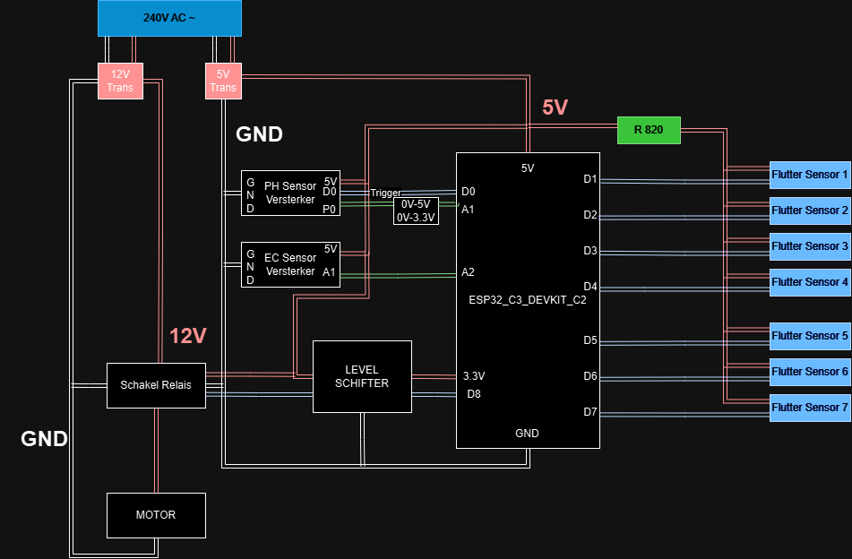

# GreenhouseWateringSystem
## Planning

### software 

* Database Ontwerpen
* GUI ontwerpen om data op te displayen
* Wheaterforcast programma ontwerpen
  * Deze moet ook dan bereken aan de hand van het opp van de serre hoeveel liter er bij zal komen in 1/3/7 dagen
  * Deze data dan versturen naar de database zodat deze ook kan worden displayed 
* Water reservoir inhoud meten programma ontwerpen
   * Deze data ook doorsturen naar de database voor GUI
* Aan de hand van de vlotter sensoren een programma schrijven om de motor aan te sturen om tank 1 te legen in tank 2
* Dan de EC en PH sensoren implementeren voor tank 2
  * Deze data dan ook bechikbaar maken op de GUI
* Een Alert systeem ontwerpen voor waneer waarden te hoog of te laag zijn dat er een melding word gegeven
* Implementatie voor Networking Home Assistant zodat deze de data ook kunne hebben
* De GUI fine tunen
* De CODE fine tunen

### Documentatie

* Architectuur betsand afmaken
* Alle componenten documenteren
* ReadMe bijwerken
* ...

### Hardware 

* afvoer van regenwater van serre naar reservoir.
* elektrisch circuit van pomp aangestuurd door relais.
* microcontroller en sensoren voor kwaliteit van water.
* microcontroller en sensoren voor volume water.
* microcontroller voor weersvoorspellingen.
* afvoer voor overtollig water.
* ...

## Project Overview
This project is a collaborative effort by our team to design and implement a high-tech, eco-friendly water management system for a greenhouse on our campus. The goal is to maximize the use of natural resources, such as rainwater, and create a sustainable, automated system that ensures the optimal growth environment for plants while minimizing water waste.

## Key Features:
* Rainwater Collection & Filtration: The system captures rainwater from the greenhouse roof, filters out debris (such as sand, dirt, and leaves), and stores it in a reservoir for use in watering the plants.

* Nutrient and Mineral Monitoring: Sensors continuously monitor the water quality, including its mineral and nutrient levels. The system automatically assesses whether additional nutrients need to be added to 
  support healthy plant growth.

* pH Level Monitoring: The pH value of the water is crucial for plant health. Our system checks the pH level and sends alerts to users if adjustments are required to maintain the ideal range for plant growth.

* Reservoir Level Detection: The system includes sensors to track the water level in the reservoir. It can detect when the reservoir is nearly full or nearly empty. To prevent running out 
  of water.

* Smart Watering Schedule: The system integrates weather forecast data to optimize water usage. It ensures plants are watered when needed, but only if there’s enough water in the reservoir or if rain is 
  expected soon. This prevents overwatering and conserves resources.

* User Notifications: Whenever the system detects an issue, such as a low water level, a nutrient imbalance, or an out-of-range pH level, it will automatically send alerts to the users so timely actions can 
  be taken.

## Why This Project Matters
Our goal is to create a sustainable, automated greenhouse that not only minimizes water waste but also ensures that plants receive the exact amount of water and nutrients they need. By using rainwater and optimizing its use based on weather forecasts, we are aligning this project with the campus’s green initiatives.

This project will serve as a model for future greenhouse installations, providing both environmental and educational value. It demonstrates how technology can be leveraged to create efficient and sustainable agriculture systems in an urban setting.

# Architectuur

